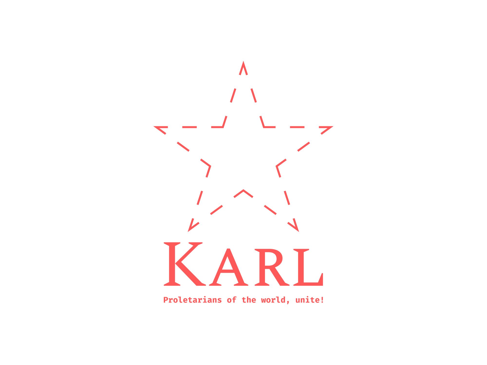

# The Karl Programming Language

## 全世界无产者，联合起来！



一门正在开发的编程语言，名称源于 全世界无产阶级和劳动人民的伟大导师 卡尔·马克思（Karl Marx）。

语法示例如下：

```karl
func fib(n: int) : int {
    if (n == 1 || n == 0) {
        return 1;
    }
    return fib(n - 1) + fib(n - 2)
}

func main() : void {
    var a: int = 10, i: int = 0;
    while (i <= n) {
        i = i + 1;
        print(fib(i));
    }
}
```